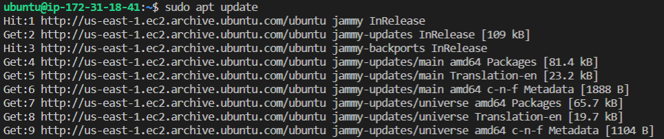
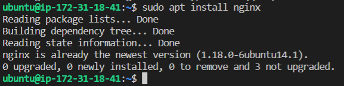
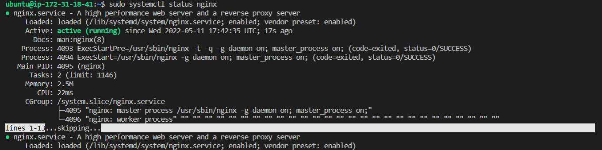

## In this project I will be implmenting web solutions deployment using LA(E)MP stacks. This stack uses the **NGNIX** web server.
 

## 1. Installing the *Ngnix* web server
## The ***Ngnix*** is a high performance web server used to display web pages to site visitors. ##
 

- Update the server's package index and use the ***apt*** package manager to install ***nginx*** 

- Check the status of your web server installation

    *sudo systemctl status nginx*

    If you already have apache server running on your machine, you will get an error message when you try to check nginx status. It means you already have a process bound to **HTTP port 80** (because after you upgraded the system, it will start apache2 by default). To solve this problem, first stop the apache2 service  

    *sudo service apache2 stop* 
     
[click here for more](https://stackoverflow.com/questions/51525710/nginx-failed-to-start-a-high-performance-web-server-and-a-reverse-proxy-server)   If  everything is good you should get something that looks like the image below  
  
move to the last line and hit *q* botton on the keyboard to exit or *:* then *q* 

 

