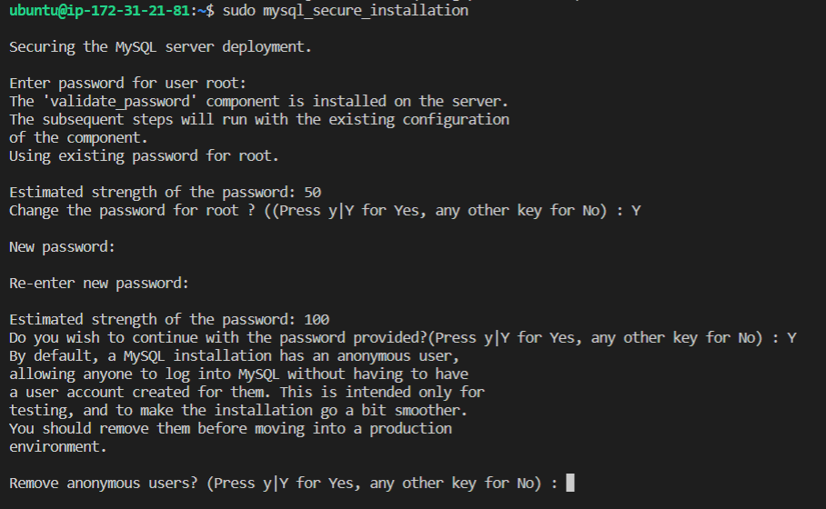
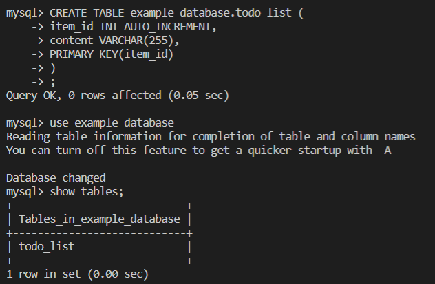
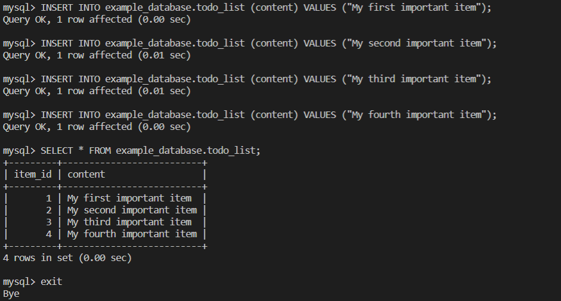

### In this project I will be implmenting web solutions deployment using LA(E)MP stacks. This stack uses the **NGNIX** web server.
 

### 1. Installing the *Ngnix* web server
### The ***Ngnix*** is a high performance web server used to display web pages to site visitors. 
 

- Update the server's package index and use the ***apt*** package manager to install ***nginx*** 

- Check the status of your web server installation

    *sudo systemctl status nginx*

    If you already have apache server running on your machine, you will get an error message when you try to check nginx status. It means you already have a process bound to **HTTP port 80** (because after you upgraded the system, it will start apache2 by default). To solve this problem, first stop the apache2 service  

    *sudo service apache2 stop* 
     
[click here for more](https://stackoverflow.com/questions/51525710/nginx-failed-to-start-a-high-performance-web-server-and-a-reverse-proxy-server)   If  everything is good you should get something that looks like the image below  
  
move to the last line and hit *q* botton on the keyboard to exit or *:* then *q* 

### This was very helpful:
### I mistakenly killed a process running on a port on my linux server, this link helped me resumed it 
[click here](https://ostechnix.com/suspend-process-resume-later-linux/)

[for some more details click here](https://www.ibm.com/docs/en/aix/7.1?topic=processes-restarting-stopped-process)
 

I had to re-create another EC2 instance to install *nginx* web server, beacuse I had some challenges on getting it to work properly on the server which had apache2 pre-installed.

Nginx works well now  

### 2. Installing ***MYSQL***
- Install *mysql* from apt manager
 

 

- Launch *mysql* 
 

 

- If you want more information about setting the password to *mysql* server [click here](https://exerror.com/failed-error-set-password-has-no-significance-for-user-rootlocalhost-as-the-authentication-method-used-doesnt-store-authentication-data-in-the-mysql-server/)

- here you run ***ALTER USER 'root'@'localhost' IDENTIFIED WITH mysql_native_password by 'mynewpassword';*** on *mysql* environment (***sudo mysql*** takes you there, after installation) 
 

- Exit *mysql* window and run ***sudo mysql_secure_installation*** you'll be required to type the password you specified above (***mynewpassword***), then required to chabge it.
 

- Proceed to make the following change
 

 
 
Then ***exit*** *mysql*

- Load *mysql* with the *p* tag i.e ***sudo mysql -p***  
then input your password
 

 

### 3. Install *PHP* for *NGINX* server
You will need to install "PHP fastCGI process manager" (***php-fpm***) which is an external program that handles *PHP* processing and acts as a bridge between *PHP* interpreter itself and the *Nginx* web server. While *Apahe* embeds the *PHP* interpreter in each request, the *Nginx* requires this external program. 

 

 

### 4. Configure *NGINX* to use *PHP* processor
- Create a new domain  
Just as with the Apache server, we can create server blocks (virtual hosts) to encapsulate configuration details and host more than one domain on a single Nginx server. By default Nginx has one server block enabled and configured to serve documents out of a directory */var/www/html* This works well for a single site and becomes difficult to manage if we are hosting multiple sites. Here we create a new domain, ***projectLEMP*** (i.e. a root web directory and assign ownership). 

    

- Configuration file  
    Create a configuration file in Nginx's sites-available directory (make sure you create the file using superuser permission, *sudo*, else you won't be allowed to save it) and add the bare-bones configuration settings. [click here](https://www.darey.io/docs/step-4-configuring-nginx-to-use-php-processor/)  

    Then activate your configuration by linking to the config file from Nginx's *sites-enabled* directory. This will tell Nginx to use the configuration next time it is loaded. Test your configuration for syntax errors 
     

    
    
    Disable the default *Nginx* host that is corrently configured to listen on port 80, by unlinking it.

    Then reload *Nginx* to apply the changes.  

    

    Create an ***index.html*** file in the recently created root web location (*/var/www/projectLEMP*) to test that the virtual host works (paste your public IP address in a browser). 

    To find out your public IP address:  
    ***curl -s http://169.254.169.254/latest/meta-data/public-ipv4***
     
    To find out your public hostname (DNS name):  
    ***curl -s http://169.254.169.254/latest/meta-data/public-hostname***  

    

    Now, the LEMP stack is fully configured. Next is to create a *PHP* script to test that *Nginx* is able to handle *.php* files within the newly configured website.

    For now, we will leave the newly created *.html* file as temporary landng page for our application until we setup *.php* file to replace it. When you do this, always remember to remove or rename the *index.html* file from your document root as it would take precedence over an *index.php* file by default (although, you can change this hierarchy from your configured file in  ***/etc/nginx/sites-available/projectLEMP***). 
    
     

### 5.   Testing *PHP* with *NGINX*
- Here we want to test that *Nginx* can corretly hand *.php* files off to your *PHP* processor. and we do this by creating a test *php* file in the document root

 

 

- This file should contain the info below: 
*<?php  
phpinfo();*

 
This page can be accessed on our web browser by using the domain name or public IP address followed by  */info.php*

 

 
Note that it is best practice to delete your *php* file

 

### 6. Retrieving Data from MYSQL Database with PHP  
- Here we will create a database and configure access to it, so that the Nginx website would be able to query data from the DB and display it.  
- Create database named ***example_database*** and a user named ***example_user*** ( using ***mysql_native_password*** as default authentication method, where we define this user's password as ***password*** ) and give this users permission over the ***example_database*** (this will give the ***example_user*** full privileges over the ***example_database*** , while preventing this user from creating or modifying other databases on your server) 

 

 

- Log into *MySQL* as this user (using the *-u* tag) and confirm access to the ***example_database*** database . 

 

 

- Create a table ***todo_list***. Note that *SQL* syntax are not case sensitive 
 

 
 
 - Notice that in the creation of your tables, you specify the column names and when you insert rows (data), you mention the column name in which the data goes into. For more MySQL lessons, [click here](https://www.youtube.com/playlist?list=PLS1QulWo1RIY4auvfxAHS9m_fZJ2wxSse) 
 For SQL documentation [click here](https://www.w3schools.com/sql/sql_create_table.asp) 

 - Insert rows into your tables 
  

 
 
- Next we Create a *php* script that will connect *MySQL* database and query for the content of the ***todo_list*** table and help displays the result as a list, on the website.  

 
 

[content of the todo_list.php ](https://www.darey.io/docs/step-6-retrieving-data-from-mysql-database-with-php-continued-2/)  

- The content will display on your browser as shown below:
 

 

- This means the ***PHP*** environment is ready to interact with MySQL server.

 

In this project I have successfully built a flexible foundation for serving *PHP* websites and applications to visitors, using *Nginx* as wed server and *MySQL* as database management system. 

